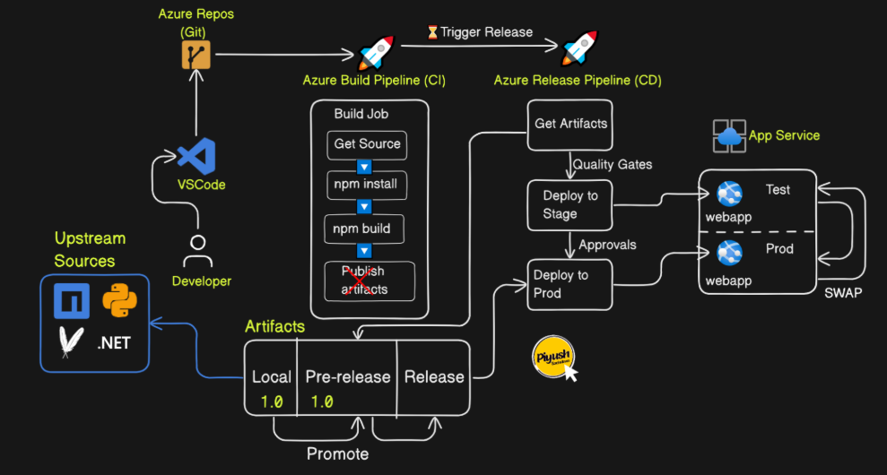
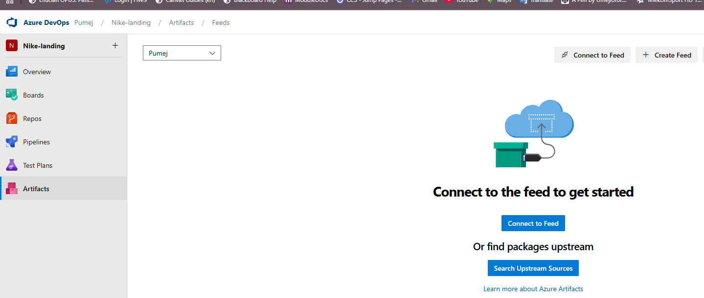
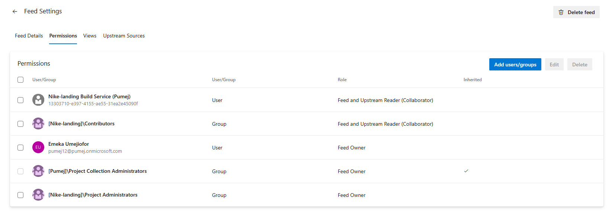
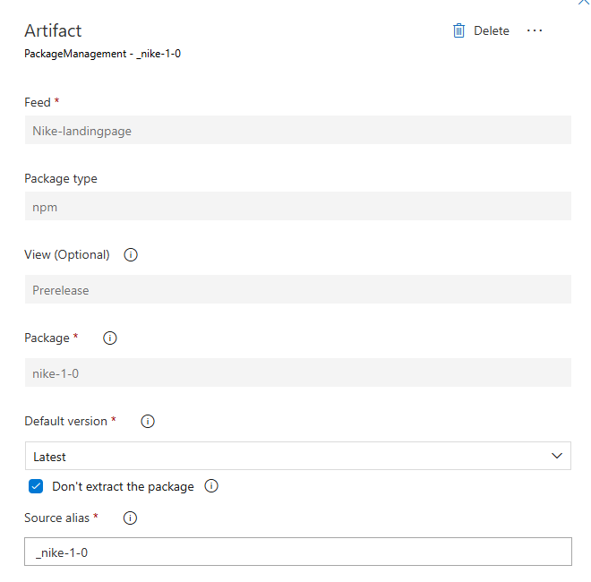
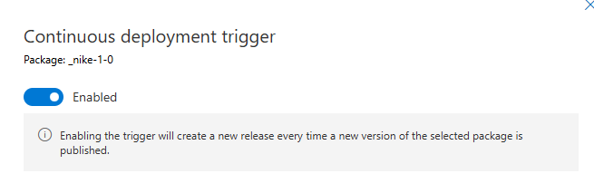

## This project invloves the deployment of a Nike landing page using Azure web app service. The CICD Build Pipeline genreates the build artifacts which is then consumed by a Release pipeline.

## Project Architectural Diagram 



- Set up the project in Azure devops by creating a repository project called Nike-landing
- Push the code from your local repository to remote repository
- Create the build pipeline using the below sample yaml file. Make sure to define the Feed_DETAILS variable. 

```bash
trigger: 
- main

stages:
- stage: Build
  jobs:
  - job: Build
    pool:
      vmImage: 'ubuntu-latest'
    steps:
    - task: Npm@1
      inputs:
        command: 'custom'
        customCommand: 'install -D tailwindcss postcss autoprefixer'
    - task: Npm@1
      inputs:
        command: 'custom'
        customCommand: 'run build'

    - task: Npm@1
      inputs:
        command: 'publish'
        workingDir: './dist'
        publishRegistry: 'useFeed'
        publishFeed: '$FEED_DETAILS'
```

- Set up an Azure web service app as the project is ran in a SAAS platform. Make sure to set below two variables for the app service configurstion

```bash
WEBSITE_DYNAMIC_CACHE=0
WEBSITE_LOCAL_CACHE_OPTION=Never
```

## Set up ARTIFACTS Feed for Local view!!!

- Set up the artifacts feed also for the CICD pipeline. Go to Artifacts section and create Feed.
- This feed is for local view. Other views Pre-release and Release views would get the artifacts after they are promoted. 



- Make sure to assign the right access Contributor permissions so the artifacts can be published. 
- Use the field setting button to grant right permissions to the build pipeline user. Do this under permission section. 



## Setting up Release pipeline to consume the promoted artifacts!!!

- The Build pipeline itself we created earlier does not support Azure artifacts as the upstream trigger, hence the need for a Release pipeline. 
- Set up a Release pipeline using the GUI with the Azure artifacts repo set as upstream trigger for the release pipeline. 
- Reference picture below and fill out the details for the artifacts with trigger for Pre-release. 



- Make sure to enable Continous Deployment trigger by toggling the radio icon. 



- Complete the rest of the Release pipeline (Deployment, Run on agent and Deploy azure app service), set up the webapp service and its service connection. Link it to your app service name. 
- Add a post-deployment stage in the pipeline for an inline script to be executed 

```bash
cp -rf /home/site/wwwroot/package/* /home/site/wwwroot/                         | This is so the files get moved to the wwwroot/ dir where it gets served.
```